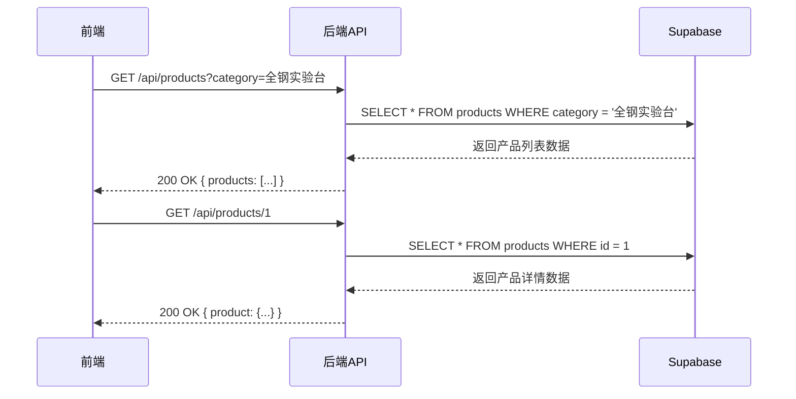
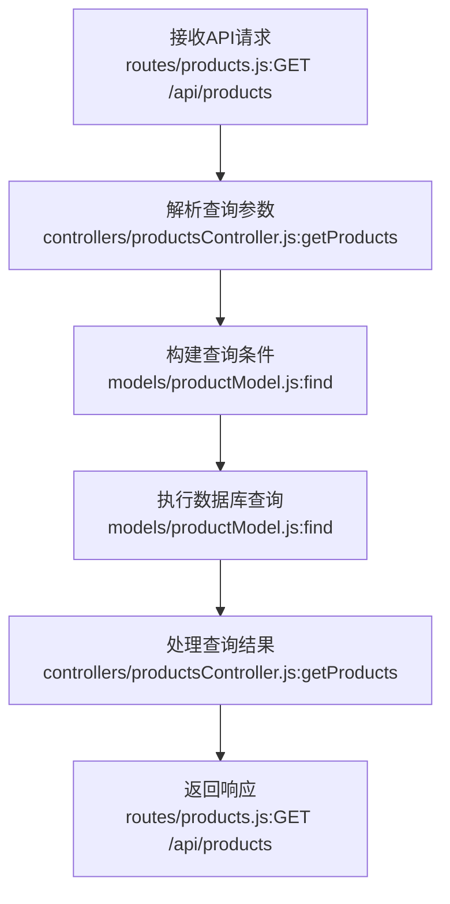
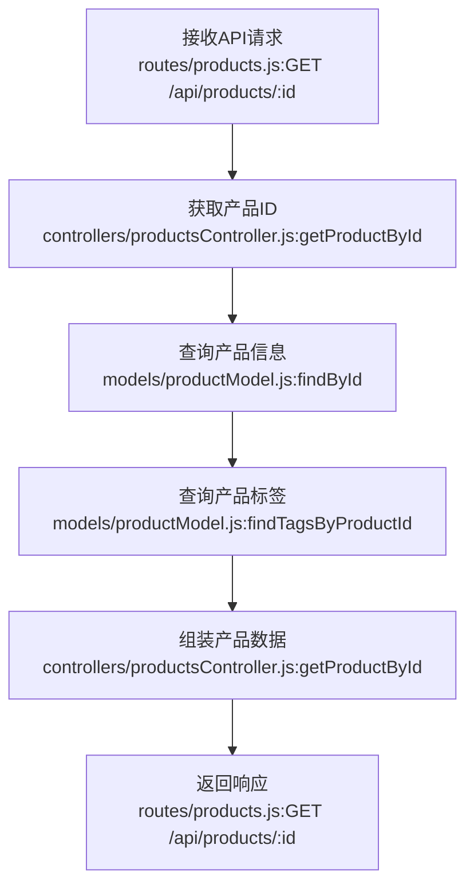
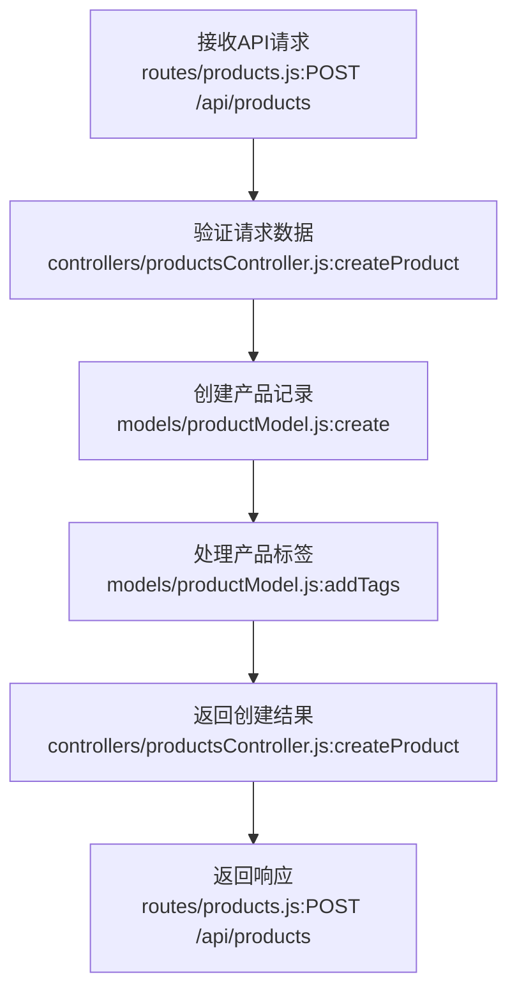

# 后端技术实现方案

## 1. 仓库分析

通过对前端仓库的分析，我们发现这是一个实验室设备展示系统，主要功能包括：

### 1.1 前端结构
- 基于 React 19 + TypeScript + Vite 构建
- 主要组件：Navbar、Footer、Hero、Sidebar、ProductGrid
- 页面结构：首页（HOME）和产品列表页（PRODUCTS）

### 1.2 数据模型
从 `types.ts` 文件中，我们可以看到前端定义了以下数据类型：

```typescript
export interface Product {
  id: string;
  name: string;
  sku: string;
  description: string;
  image: string;
  tags: string[];
  category: string;
  badge?: string;
  badgeColor?: string;
}

export type ViewType = 'HOME' | 'PRODUCTS';

export interface NavItem {
  label: string;
  href: string;
  active?: boolean;
}
```

### 1.3 数据源
目前前端使用 `constants.tsx` 中的静态数据 `PRODUCTS` 数组作为数据源，包含 6 个产品，每个产品都有完整的字段信息。

### 1.4 功能需求
1. **产品列表展示**：支持分页和分类筛选
2. **产品详情**：查看单个产品的详细信息
3. **分类管理**：支持按分类筛选产品
4. **标签系统**：产品可以有多个标签

## 2. 后端系统技术方案

### 2.1. 技术选型

| 分类 | 技术 | 版本 | 选型理由 |
| :--- | :--- | :--- | :--- |
| 语言 | Node.js | 16+ | 轻量高效，生态丰富，适合构建 RESTful API。 |
| 框架 | Express | 4.18+ | 成熟稳定，路由系统强大，中间件丰富，适合构建 Web 服务。 |
| 数据库 | Supabase | 最新版 | 基于 PostgreSQL，提供实时数据库、认证、存储等功能，适合快速构建后端系统。 |
| 认证 | JWT | - | 无状态认证，便于水平扩展。 |
| 缓存（可选） | Redis | 7.0+ | 用于缓存热点数据，提高查询性能。 |

### 2.2. 关键设计

#### 2.2.1. 架构设计
- **架构风格**: 集成式单体应用 (Integrated Monolith)。后端逻辑作为独立模块，与前端通过 API 交互。
- **模块划分**:
  - `backend/app.js`: 应用入口，配置中间件和路由
  - `backend/routes/`: API 路由定义
  - `backend/controllers/`: 业务逻辑处理
  - `backend/models/`: 数据模型和数据库操作
  - `backend/config/`: 配置文件
  - `backend/utils/`: 工具函数

- **核心流程图**:



#### 2.2.2. 目录结构

```plaintext
backend/       # 后端应用
  ├── app.js         # 应用入口
  ├── package.json   # 依赖管理
  ├── config/        # 配置文件
  │   └── supabase.js # Supabase 配置
  ├── routes/        # API 路由
  │   ├── products.js # 产品相关路由
  │   └── categories.js # 分类相关路由
  ├── controllers/   # 控制器
  │   ├── productsController.js # 产品业务逻辑
  │   └── categoriesController.js # 分类业务逻辑
  ├── models/        # 数据模型
  │   ├── productModel.js # 产品模型
  │   └── categoryModel.js # 分类模型
  └── utils/         # 工具函数
      └── errorHandler.js # 错误处理
```

* 说明：
  * `routes/`（新增）：对外接口入口，集成所有路由。
  * `controllers/`（新增）：业务逻辑层，负责处理业务逻辑。
  * `models/`（新增）：数据模型层，定义数据库表结构和操作。
  * `config/`（新增）：配置文件，存储数据库连接信息等。
  * `utils/`（新增）：工具函数，提供通用功能。

#### 2.2.3. 关键类与函数设计

| 类/函数名 | 说明 | 参数（类型/含义） | 成功返回结构/类型 | 失败返回结构/类型 | 所属文件/模块 | 溯源 |
|----------|------|-----------------|-----------------|-----------------|-------------|------|
| `ProductController.getProducts` | 获取产品列表 | category: string 分类名称<br>page: number 页码<br>limit: number 每页数量 | `{ products: Product[], total: number, page: number, limit: number }` | `{ error: string, code: number }` | controllers/productsController.js | <mcfile>c:\ideaPlace\bak\labdesign-pro\components\ProductGrid.tsx</mcfile> |
| `ProductController.getProductById` | 获取产品详情 | id: string 产品ID | `{ product: Product }` | `{ error: string, code: number }` | controllers/productsController.js | <mcfile>c:\ideaPlace\bak\labdesign-pro\components\ProductGrid.tsx</mcfile> |
| `CategoryController.getCategories` | 获取分类列表 | 无 | `{ categories: Category[] }` | `{ error: string, code: number }` | controllers/categoriesController.js | <mcfile>c:\ideaPlace\bak\labdesign-pro\components\Sidebar.tsx</mcfile> |
| `ProductModel.find` | 查询产品列表 | query: object 查询条件<br>options: object 分页选项 | `Promise<Product[]>` | `Promise<Error>` | models/productModel.js | <mcfile>c:\ideaPlace\bak\labdesign-pro\components\ProductGrid.tsx</mcfile> |
| `ProductModel.findById` | 根据ID查询产品 | id: string 产品ID | `Promise<Product>` | `Promise<Error>` | models/productModel.js | <mcfile>c:\ideaPlace\bak\labdesign-pro\components\ProductGrid.tsx</mcfile> |
| `CategoryModel.find` | 查询分类列表 | 无 | `Promise<Category[]>` | `Promise<Error>` | models/categoryModel.js | <mcfile>c:\ideaPlace\bak\labdesign-pro\components\Sidebar.tsx</mcfile> |

#### 2.2.4. 数据库与数据结构设计

- **数据库表结构**:

**`products` 表**
| 字段名 | 数据类型 | 约束 | 描述 |
| :--- | :--- | :--- | :--- |
| `id` | `VARCHAR(50)` | `PRIMARY KEY` | 产品ID |
| `name` | `VARCHAR(255)` | `NOT NULL` | 产品名称 |
| `sku` | `VARCHAR(50)` | `NOT NULL UNIQUE` | 产品SKU |
| `description` | `TEXT` | `NOT NULL` | 产品描述 |
| `image` | `VARCHAR(500)` | `NOT NULL` | 产品图片URL |
| `category` | `VARCHAR(100)` | `NOT NULL` | 产品分类 |
| `badge` | `VARCHAR(50)` | | 产品徽章 |
| `badge_color` | `VARCHAR(50)` | | 徽章颜色 |
| `created_at` | `TIMESTAMP` | `DEFAULT CURRENT_TIMESTAMP` | 创建时间 |
| `updated_at` | `TIMESTAMP` | `DEFAULT CURRENT_TIMESTAMP` | 更新时间 |

**`categories` 表**
| 字段名 | 数据类型 | 约束 | 描述 |
| :--- | :--- | :--- | :--- |
| `id` | `VARCHAR(50)` | `PRIMARY KEY` | 分类ID |
| `name` | `VARCHAR(100)` | `NOT NULL UNIQUE` | 分类名称 |
| `created_at` | `TIMESTAMP` | `DEFAULT CURRENT_TIMESTAMP` | 创建时间 |
| `updated_at` | `TIMESTAMP` | `DEFAULT CURRENT_TIMESTAMP` | 更新时间 |

**`tags` 表**
| 字段名 | 数据类型 | 约束 | 描述 |
| :--- | :--- | :--- | :--- |
| `id` | `VARCHAR(50)` | `PRIMARY KEY` | 标签ID |
| `name` | `VARCHAR(100)` | `NOT NULL UNIQUE` | 标签名称 |
| `created_at` | `TIMESTAMP` | `DEFAULT CURRENT_TIMESTAMP` | 创建时间 |

**`product_tags` 表**
| 字段名 | 数据类型 | 约束 | 描述 |
| :--- | :--- | :--- | :--- |
| `id` | `SERIAL` | `PRIMARY KEY` | 主键 |
| `product_id` | `VARCHAR(50)` | `REFERENCES products(id)` | 产品ID |
| `tag_id` | `VARCHAR(50)` | `REFERENCES tags(id)` | 标签ID |
| `created_at` | `TIMESTAMP` | `DEFAULT CURRENT_TIMESTAMP` | 创建时间 |

- **数据传输对象 (DTOs)**:

```javascript
// 产品列表响应
const ProductListResponse = {
  products: [{
    id: "1",
    name: "中央实验台 XL-201",
    sku: "#2024-B01",
    description: "采用12.7mm厚实芯理化板，具有卓越的耐酸碱与抗冲击性能。全钢模块化结构，专为高强度科研环境打造。",
    image: "https://example.com/image.jpg",
    tags: ["实芯理化板", "全钢模块"],
    category: "全钢实验台",
    badge: "主推产品",
    badgeColor: "bg-primary-500"
  }],
  total: 6,
  page: 1,
  limit: 12
};

// 产品详情响应
const ProductDetailResponse = {
  product: {
    id: "1",
    name: "中央实验台 XL-201",
    sku: "#2024-B01",
    description: "采用12.7mm厚实芯理化板，具有卓越的耐酸碱与抗冲击性能。全钢模块化结构，专为高强度科研环境打造。",
    image: "https://example.com/image.jpg",
    tags: ["实芯理化板", "全钢模块"],
    category: "全钢实验台",
    badge: "主推产品",
    badgeColor: "bg-primary-500"
  }
};

// 分类列表响应
const CategoryListResponse = {
  categories: [
    { id: "1", name: "全钢实验台" },
    { id: "2", name: "通风柜系统" },
    { id: "3", name: "配套设施" },
    { id: "4", name: "药品存储柜" }
  ]
};
```

| 配置项 | 类型 | 默认值 | 说明 | 所属文件/模块 | 类型 | 溯源 |
| --- | --- | --- | --- | --- | --- | --- |
| `SUPABASE_URL` | string | - | Supabase 项目 URL | config/supabase.js | 新增 | <mcfile>c:\ideaPlace\bak\labdesign-pro\.env.local</mcfile> |
| `SUPABASE_ANON_KEY` | string | - | Supabase 匿名访问密钥 | config/supabase.js | 新增 | <mcfile>c:\ideaPlace\bak\labdesign-pro\.env.local</mcfile> |
| `PORT` | number | 3001 | 后端服务端口 | app.js | 新增 | <mcfile>c:\ideaPlace\bak\labdesign-pro\package.json</mcfile> |
| `CORS_ORIGIN` | string | "*" | CORS 允许的源 | app.js | 新增 | <mcfile>c:\ideaPlace\bak\labdesign-pro\App.tsx</mcfile> |

#### 2.2.4. API 接口设计

| API路径 | 方法 | 模块/文件 | 类型 | 功能描述 | 请求体 (JSON) | 成功响应 (200 OK) |
| :--- | :--- | :--- | :--- | :--- | :--- | :--- |
| `/api/products` | `GET` | `routes/products.js` | `Router` | 获取产品列表，支持分页和分类筛选 | N/A (查询参数: category, page, limit) | `{ "products": [...], "total": 6, "page": 1, "limit": 12 }` |
| `/api/products/:id` | `GET` | `routes/products.js` | `Router` | 获取产品详情 | N/A | `{ "product": {...} }` |
| `/api/products` | `POST` | `routes/products.js` | `Router` | 创建新产品 | `{ "name": "...", "sku": "...", "description": "...", "image": "...", "category": "...", "tags": [...], "badge": "...", "badgeColor": "..." }` | `{ "product": {...} }` |
| `/api/products/:id` | `PUT` | `routes/products.js` | `Router` | 更新产品信息 | `{ "name": "...", "sku": "...", "description": "...", "image": "...", "category": "...", "tags": [...], "badge": "...", "badgeColor": "..." }` | `{ "product": {...} }` |
| `/api/products/:id` | `DELETE` | `routes/products.js` | `Router` | 删除产品 | N/A | `{ "message": "Product deleted successfully" }` |
| `/api/categories` | `GET` | `routes/categories.js` | `Router` | 获取分类列表 | N/A | `{ "categories": [...] }` |
| `/api/categories` | `POST` | `routes/categories.js` | `Router` | 创建新分类 | `{ "name": "..." }` | `{ "category": {...} }` |
| `/api/categories/:id` | `PUT` | `routes/categories.js` | `Router` | 更新分类信息 | `{ "name": "..." }` | `{ "category": {...} }` |
| `/api/categories/:id` | `DELETE` | `routes/categories.js` | `Router` | 删除分类 | N/A | `{ "message": "Category deleted successfully" }` |

#### 2.2.5. 主业务流程与调用链

**1. 获取产品列表流程**



**2. 获取产品详情流程**



**3. 创建产品流程**



* 调用链示例：
  * `routes/products.js:GET /api/products` → `controllers/productsController.js:getProducts()` → `models/productModel.js:find()`
  * `routes/products.js:GET /api/products/:id` → `controllers/productsController.js:getProductById()` → `models/productModel.js:findById()`
  * `routes/categories.js:GET /api/categories` → `controllers/categoriesController.js:getCategories()` → `models/categoryModel.js:find()`

## 3. 部署与集成方案

### 3.1. 依赖与环境

| 依赖 | 版本/范围 | 用途 | 安装命令 | 所属文件/配置 |
| :--- | :--- | :--- | :--- | :--- |
| `express` | `^4.18.2` | Web 框架 | `npm install express` | backend/package.json |
| `@supabase/supabase-js` | `^2.39.0` | Supabase 客户端 | `npm install @supabase/supabase-js` | backend/package.json |
| `cors` | `^2.8.5` | CORS 中间件 | `npm install cors` | backend/package.json |
| `dotenv` | `^16.3.1` | 环境变量管理 | `npm install dotenv` | backend/package.json |
| `uuid` | `^9.0.1` | 生成唯一 ID | `npm install uuid` | backend/package.json |

### 3.3. 集成与启动方案

- **配置文件 (`backend/.env`)**:

```dotenv
# Supabase 配置
SUPABASE_URL=your-supabase-url
SUPABASE_ANON_KEY=your-supabase-anon-key

# 服务器配置
PORT=3001
```

- **启动脚本 (`backend/package.json`)**:

```json
{
  "name": "labdesign-backend",
  "version": "1.0.0",
  "description": "Backend API for labdesign-pro",
  "main": "app.js",
  "scripts": {
    "start": "node app.js",
    "dev": "nodemon app.js",
    "test": "echo \"Error: no test specified\" && exit 1"
  },
  "dependencies": {
    "express": "^4.18.2",
    "@supabase/supabase-js": "^2.39.0",
    "cors": "^2.8.5",
    "dotenv": "^16.3.1",
    "uuid": "^9.0.1"
  },
  "devDependencies": {
    "nodemon": "^3.0.1"
  }
}
```

- **启动流程**:
  1. 在 `backend` 目录下执行 `npm install` 安装依赖
  2. 配置 `.env` 文件，填写 Supabase 相关信息
  3. 执行 `npm run dev` 启动开发服务器
  4. 服务器将在 `http://localhost:3001` 上运行

### 4. 代码安全性

#### 4.1. 注意事项

1. **SQL 注入风险**：使用参数化查询，避免直接拼接 SQL 语句
2. **跨站脚本攻击 (XSS)**：对输入数据进行验证和转义
3. **跨站请求伪造 (CSRF)**：实现适当的 CSRF 保护机制
4. **敏感信息泄露**：不在响应中返回敏感信息，使用环境变量存储配置
5. **CORS 配置**：正确配置 CORS 策略，避免不必要的跨域访问
6. **API 速率限制**：实现速率限制，防止恶意请求
7. **数据验证**：对所有用户输入进行严格验证

#### 4.2. 解决方案

1. **使用 Supabase 客户端**：Supabase 客户端内置了参数化查询，可防止 SQL 注入
2. **输入验证**：使用 Express 中间件对请求数据进行验证
3. **环境变量管理**：使用 dotenv 管理敏感配置，避免硬编码
4. **CORS 配置**：使用 cors 中间件，根据实际需求配置允许的源
5. **错误处理**：实现统一的错误处理机制，避免暴露内部错误信息
6. **API 设计**：遵循 RESTful API 设计规范，使用适当的 HTTP 方法和状态码
7. **数据加密**：对于敏感数据，使用适当的加密算法

### 5. 总结

本技术方案基于前端仓库分析，设计了一个完整的后端系统，使用 Node.js + Express + Supabase 技术栈，实现了产品管理、分类管理等核心功能。方案考虑了安全性、可扩展性和性能，为前端应用提供了稳定可靠的 API 支持。

通过本方案的实施，前端应用将从静态数据迁移到动态数据，支持产品的增删改查操作，为用户提供更好的体验。同时，后端系统的模块化设计也为未来的功能扩展和维护提供了便利。